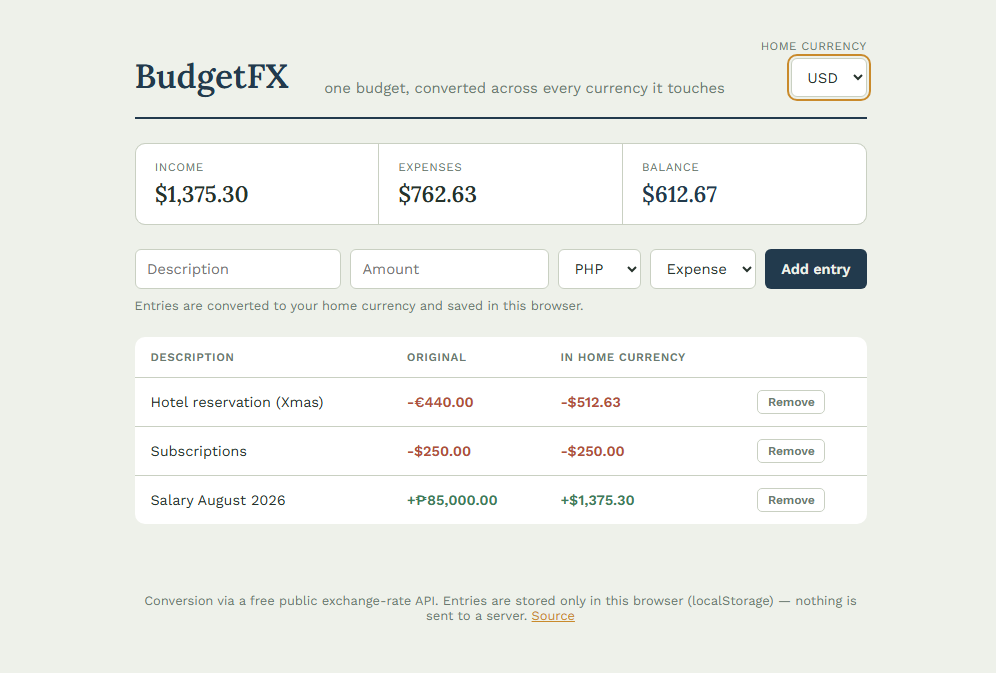

# BudgetFX — Multi-Currency Budget Planner

A budget ledger for anyone earning, spending, or sending money across more than one currency: log income and expenses in whatever currency they actually happened in, and see everything converted and totaled in one home currency.

**[Live demo →](https://arjayb.github.io/BudgetFX/)**



## Features

- Add income/expense entries in any of six currencies (PHP, USD, EUR, GBP, AED, SGD)
- Live conversion to a selectable home currency for every entry and the running summary (income, expenses, balance)
- Entries persist in the browser via `localStorage` — reload-safe, no account needed
- Full CRUD — add and remove entries at any time
- Handles the real edge case of a public rate API: if a rate can't be fetched, that row shows "rate unavailable" instead of a wrong number
- Zero dependencies — vanilla HTML, CSS, and JavaScript

## Why no backend?

[open.er-api.com](https://www.exchangerate-api.com/) serves live exchange rates over plain HTTPS with CORS enabled, so the browser can call it directly — no server needed to proxy requests or hide a key, because none is required for this kind of read-only public data.

**The trade-off:** entries live only in the browser that created them — clearing site data or switching devices loses the ledger. A production version would need a backend and accounts to sync across devices, which is exactly why nothing here is sent anywhere: it's a genuinely client-only app.

## Run it locally

Clone the repo and open `index.html` in a browser. No build step, no `npm install`.

```bash
git clone https://github.com/arjayb/BudgetFX.git
cd BudgetFX
open index.html   # or just double-click it
```

If your browser blocks `fetch` on the `file://` protocol, serve it with any static server instead:

```bash
python3 -m http.server 8000
# then visit http://localhost:8000
```

## Deploy to GitHub Pages

1. Push this repo to GitHub.
2. Go to **Settings → Pages**.
3. Under **Build and deployment**, set **Source** to `Deploy from a branch`, pick `main` and `/ (root)`.
4. Save — your app will be live at `https://<your-username>.github.io/BudgetFX/` within a minute or two.

## Project structure

```
BudgetFX/
├── index.html    # markup
├── style.css     # ledger-book theme, summary strip, entry rows
├── script.js     # localStorage persistence, exchange-rate calls, CRUD + totals
└── README.md
```

## Data source

Live rates come from [open.er-api.com](https://www.exchangerate-api.com/), a free, keyless exchange-rate API. Entry data itself never leaves the browser — it's read from and written to `localStorage` only. No authentication, no API key, no server-side storage.

## License

MIT — use this however you'd like.
